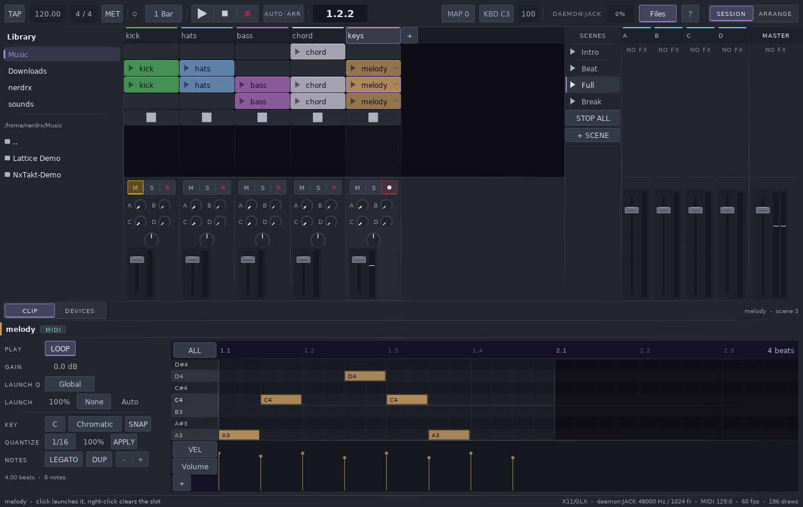
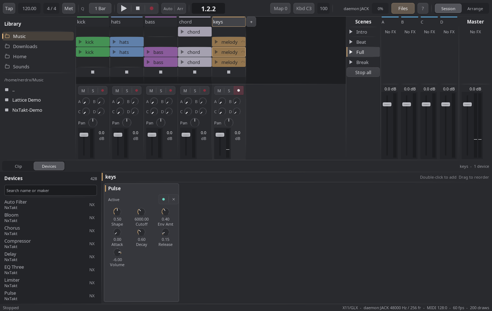
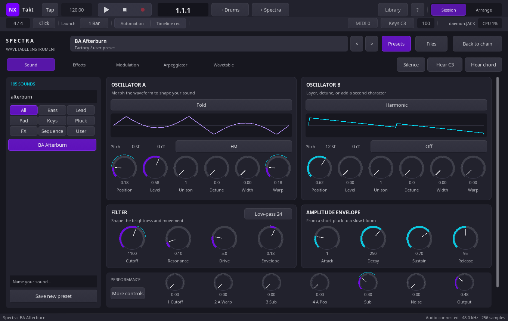
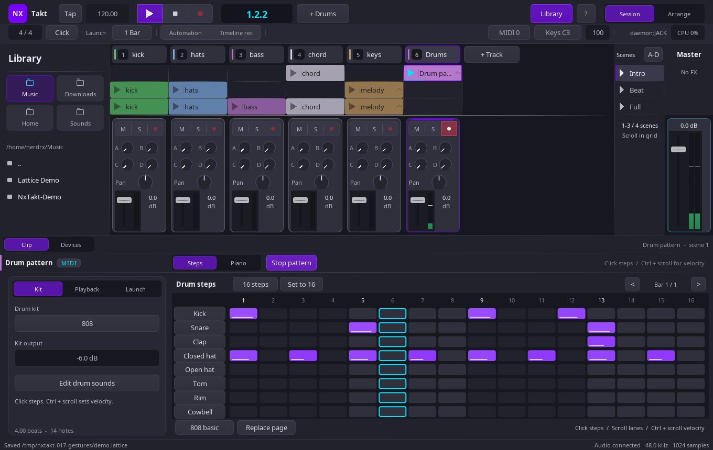

<p align="center">
  <picture>
    <source media="(prefers-color-scheme: dark)" srcset="assets/logo.svg">
    
  </picture>
</p>

<p align="center">
  <picture>
    <source media="(prefers-color-scheme: dark)" srcset="assets/wordmark.svg">
    
  </picture>
</p>

<p align="center">
  <b>Session-first. Sample-accurate. Text on disk.</b><br>
  A native Linux DAW, written from scratch in C++20 — no framework, no toolkit, no runtime.
</p>

<p align="center">
  <a href="https://github.com/nerdrx/nxtakt/actions/workflows/ci.yml"></a>
  <a href="https://github.com/nerdrx/nxtakt/actions/workflows/windows.yml"></a>
  <a href="LICENSE"></a>
</p>

<p align="center">
  
</p>

The workflow is Ableton Live's: a grid of clips you launch against a global
tempo grid, quantised to musical boundaries. The architecture is not Live's,
and that is the point.

---

### Your set is text

A project is one line-oriented plain-text file with a byte-identical
round-trip and stable per-entity uids. A melody is eight `note <beat> <len>
<pitch> <vel>` lines. Diff a mix, branch an arrangement, review a track in a
pull request, generate a set from a script.

### The audio thread shares nothing

No allocation, no locks, no pointers into GUI memory: the interface reaches the
engine through a lock-free command ring and a block of atomics. Launches are
split inside the buffer, so a clip starts on the exact frame of its quantum
rather than at the top of the next block. `nxtaktd` already runs that engine
as its own process, playing clips out of a shared-memory sample pool.

### CI plays what it builds

Every push builds the whole application, runs the headless suite — 2,500+
assertions across the engine, the IPC layer, the daemon and the devices — and then
renders five passes of the demo set to FLAC, printing the peak and RMS of each
into the run summary. The pipeline does not just compile this DAW. It hands you
the audio.

---

## What it does

| | |
|---|---|
| **Session View** | Clip grid, scenes, per-track stop, scene launch, stop-all, mixer strip (pan, fader, peak meters, mute/solo/arm), master strip, file browser with drag-to-slot. |
| **Piano roll** | Fold (incl. fold-to-scale), scale highlight + snap (14 modes), 1/16 grid, drag / resize / delete, multi-select, velocity lane, per-note chance and velocity range (deterministic under offline render), quantize with strength, legato, live playhead. No stuck notes across loop wraps or clip switches. |
| **MIDI in** | ALSA sequencer port plus an FL-Studio-style computer keyboard (`Ctrl+Shift+K`), routed per block to note-capable devices on armed tracks, with Live-style auto-arm on select. Overdub passes into a playing clip. |
| **Warping** | **Beats** is a two-grain overlap-add stretcher that follows the session tempo while preserving pitch; **Repitch** transposes with the tempo; **Off** ignores it. |
| **Recording** | Arm a track, click an empty slot. Quantised start and stop on the launch grid; takes come back as warped clips at the session tempo, with pre-chain input monitoring. Works identically against the engine daemon — same frames, proven. |
| **Plugins** | Per-track device chains in the signal path — **LV2** via lilv and **CLAP**, both with working note input — plus a filterable browser, bypass and parameter knobs. 410 usable on a stock Arch box. |
| **Stock devices** | Eleven, riding the same machinery as every third-party plugin: `Pulse` (8-voice PolyBLEP morph synth), `Saturator`, `EQ Three`, `Compressor`, `Delay`, `Reverb`, `Auto Filter`, `Chorus`, `Limiter` (true lookahead, honestly-reported latency), `Utility`, and `Rack` — 8 macro knobs over a nested chain, min>max inverts. |
| **Buses** | Post-fader sends into four return chains and a master chain, with plugin delay compensation aligning every parallel path into the master sum. |
| **Arrangement** | A linear timeline beside the Session grid: place, move, trim, split and fade clips, with per-track automation lanes. Play the Session live and commit the performance to the timeline — an arrangement and the performance it came from render **bit-identically**. |
| **Automation** | Clip envelopes on any track parameter or device knob, drawn in the piano roll on the notes' own time axis. Record a knob move while armed; the engine ramps within the block and never overwrites the value you set. |
| **Generative clips** | Launch probability and follow actions (Stop / Again / Next / Prev / First / Random), scheduled through the same quantised path and deterministic under offline render. |
| **Time signatures** | A map of changes along the timeline, not a global pair: bar lines, metronome accents, launch quanta and the ruler all walk it. Drawn and played bar lines come from the same function and cannot disagree. |
| **Undo** | Snapshot history over the project serializer — including the audio of unsaved takes. Gestures coalesce into one entry per drag. |
| **Engine daemon** | `nxtaktd` hosts the transport and the sample pool in its own process, over shared-memory SPSC rings with crash-orphan reaping. |
| **Windows** | The headless engine cross-builds with mingw-w64 and its test suite runs under Wine on every push. |

<p align="center">
  
</p>

## Drum pattern tools — 0.24.0

**Copy bar** copies the visible bar's eight drum lanes. **Paste bar** replaces
those lanes on the destination bar, preserving other bars and non-drum pitches.
Copy between drum clips or between Session and Arrangement. The clipboard
lasts for the current app session; pasted notes save normally with the project.
An empty copied bar clears the destination drum lanes.

**Double pattern** doubles the clip length and repeats its MIDI notes, up to
64 steps. It opens the repeated section so you can turn it into a fill.
Clip automation stays unchanged. Paste and Double pattern each create one
undo step; repeating an identical paste adds no undo entry.

## Drum rhythms — 0.23.0

Select a drum lane, choose **Hits**, **Shift**, and **Vel**, then click
**Generate rhythm** to create an evenly spaced 16-step pattern. Generation
replaces only the selected lane on the visible page; one Undo restores it.
Set Hits to zero to clear that lane. Generated notes remain editable and save
with your project. See [Creative tools](docs/CREATIVE-TOOLS.md).

## Audio I/O — 0.22.0

The top-bar **Audio I/O** control and the audio status line open the audio
settings panel. On Linux, the **JACK / PipeWire** tab exposes four searchable
routes — output left, output right, input left and input right — with
**Automatic** and **Disconnected** choices. **Apply and save** applies JACK
routing to the current engine and saves it; **Refresh** rescans available ports
while keeping unsaved selections.

The **ALSA fallback** tab lists searchable output and input PCM devices. Saved
ALSA device choices apply when the audio engine next starts and do not switch
the active backend. `NXTAKT_AUDIO` remains the backend force switch. JACK / PipeWire
continues to own sample rate and buffer size, and the Windows panel currently
uses the system default audio device with no device chooser.

See [Audio settings](docs/AUDIO-SETTINGS.md) for persistence and routing behavior.

## Creative tools — 0.21.0

Session Clip → Notes adds **Humanize** and **Strum** under the scrollable
**Feel / expression** section for non-drum MIDI clips. With notes selected, the
tools edit those notes; with no selection, they edit the whole clip. Both make
ordinary editable MIDI-note changes, use one undo step, and keep their settings
temporary.

**Humanize** applies timing variation of ±0–0.25 beats and velocity variation
of ±0–64. It preserves pitch and note length and clamps note timing to the clip
bounds.
**Strum** staggers same-start chord notes by pitch, low to high or high to low.
Its spread is the total beat distance from first to last note; the spread is
shortened near the clip end while note lengths stay unchanged. Select a chord’s
notes first when strumming only one chord.

## Creative tools — 0.20.0

Session Clip → Compose adds **Progression**. It inserts up to four chords once,
bounded by the clip: major or natural minor, four fixed sequences (including
**I - V - vi - IV**), triads or sevenths, and root-position or smooth voicing.
Set chord-beat spacing, gate percentage, start beat and root. The result is one
undoable insertion of ordinary editable MIDI notes; it does not auto-extend or
repeat.

Scale runs now offer **Up** (default), **Down** from the root, and **Up / down**,
which bounces within one octave above the root. Generated notes stay within the
clip bounds and remain ordinary editable MIDI notes.

## Creative tools — 0.19.0

Spectra now offers **Randomize sound**, **Vary macros** and an **Amount** control.
Create variations while retaining tuning, wavetable choices, master gain,
modulation routing and arpeggiator settings. Star presets to save favorites;
search, categories and previous/next navigation respect the Favorites filter.

The Session MIDI inspector's **Compose** page inserts chords with nine qualities
and inversions, or ascending scale runs with chosen timing and note lengths.
Generated notes remain editable, save normally and undo in one step. Move the
finished clip into Arrangement when ready; Compose controls currently live in
Session. See [Creative tools](docs/CREATIVE-TOOLS.md).

## Spectra Studio — 0.18.0



Press **+ Spectra** to create an instrument track and open its focused sound
editor. Five pages — **Sound**, **Effects**, **Modulation**, **Arpeggiator** and
**Wavetable** — give oscillators, routing and pattern editing room to breathe.
A searchable preset sidebar offers **185 factory entries**, including Init and
**64 new sounds**. Four performance macros and integrated chorus, ping-pong
delay and reverb make each patch ready to shape and play.

The piano roll now highlights notes delivered to the selected track from live
MIDI, the computer keyboard and clip playback. Cyan keys and pitch guides show
note gates; folded or offscreen pitches remain named. These are visual
indicators, not recorded notes, and do not follow release tails or notes
created privately inside an instrument's arpeggiator.

**Upgrade `nxtakt` and `nxtaktd` together.** This release expands parameter
transport between the interface and audio daemon; both must come from the
same release. See [the Spectra Studio guide](docs/SPECTRA-STUDIO.md) and
[the factory sound catalog](docs/SPECTRA-PRESETS.md).

## Drum studio — 0.17

Press **+ Drums** for an instrument and a ready-to-edit pattern. Eight lanes,
click-to-toggle steps, velocity editing and 16/32/64-step patterns bring a
familiar drum programming workflow to the clip editor. **Play pattern** starts
your beat; switch to **Piano** for free timing and detailed MIDI editing.

The built-in Drum Machine includes original **808-, 707- and 909-inspired**
synthesized kits, with level, tuning and decay for every sound. No sample packs
or downloads needed. See [the drum sequencer guide](docs/DRUM-SEQUENCER.md).

<p align="center">
  
</p>

## Studio workspace

A redesigned studio workspace in NX violet and cyan: a two-row transport,
numbered track headers, separated mixer channels, collapsible returns and
a larger editor with focused inspector pages and a Fit view action. Roomier controls,
clear typography, searchable plugin makers and adaptive layouts keep it usable
on smaller screens. Fast clicks respond immediately; track and
scene names work across their full label area. The Library button opens the
sample browser. Familiar F5/F6/F7/F9 navigation and subtle interaction feedback
make the workflow easier to learn. See [the interface changes](docs/UI-MAKEOVER.md)
and [the FL Studio usability pass](docs/FL-STUDIO-WORKFLOW.md).

## Quickstart

```bash
make                    # build
make test               # headless suite: engine, IPC, daemon, render, plugin scan
make tools              # gen_demo, render, pitch_check, plugin_scan
make config             # show detected Wayland protocols

build/gen_demo ~/Music/Demo    # write a four-scene demo set
build/nxtakt ~/Music/Demo/demo.lattice
```

By default, audio tries JACK first and falls back to ALSA. When JACK starts,
empty route settings use available physical ports for playback and capture.
`NXTAKT_AUDIO=jack` or `NXTAKT_AUDIO=alsa` forces a backend. See
[Audio settings](docs/AUDIO-SETTINGS.md) for route selection and saved devices.

## Under the hood

- **2,500+ assertions**, run headless on every push: engine, lock-free IPC,
  daemon, internal devices, the view's bar grid against the engine's bar
  arithmetic, and the engine handle across both of its backings — plus a render
  that fails if it comes out silent and a plugin scan that must find plugins.
- **Deterministic render.** No allocation and sample-accurate scheduling mean a
  render is reproducible frame-for-frame; delay compensation is proven by
  `cmp`-identical renders, and the zero-latency path is a hard bypass that
  leaves the old signal bit-exact.
- **Warping, measured.** A 55.0 Hz bass reads 55.11 Hz at 120 BPM and 56.21 Hz
  at 180 BPM under Beats, and 82.62 Hz under Repitch — exactly 1.5×.
- **410 LV2 plugins** discovered and instantiated on a stock Arch box,
  ASan-clean.
- **~10M messages/sec** across the shared-memory SPSC ring the process split
  runs on — design and wire format in [`docs/PROCESS-SPLIT.md`](docs/PROCESS-SPLIT.md).
- **Windows is tested, not assumed.** `engine_test.exe` is cross-compiled and
  then *run* under Wine in CI, and its check count must EQUAL the native run of
  the same source in the same job, so "the Windows build works" is a claim
  about behaviour. Scope in
  [`docs/PORTING.md`](docs/PORTING.md).
- **GPU-native UI.** Everything is SDF quads in one shader: resolution
  independent, hundreds of frames per second, with an explicit foreign-pass
  fence so a plugin editor or a spectral view can be composited inline.
- Parameter addressing for automation, MIDI-learn and OSC is already specified:
  [`docs/PARAM-ADDRESS.md`](docs/PARAM-ADDRESS.md).

## Not done yet

- VST3 is not started (licensing).
- The engine runs as its own process, and on Linux that is now the only
  engine the GUI has: it spawns (or attaches to) `nxtaktd`, which carries
  everything — clips, devices, racks with their contents, arrangements,
  signature maps, hardware MIDI and recording, with kill -9 tested in both
  directions. The old in-process path was deleted one release after the flip,
  on the flip's own schedule; `NXTAKT_ENGINE=local` now warns and opens the
  daemon (`docs/GUI-ON-DAEMON.md` §18 — the Windows port keeps the in-process
  engine, where a daemon cannot exist yet). If the daemon cannot be started
  the GUI opens anyway — editable and saveable, with a banner and a Restart
  button, deliberately not a silent second engine (§16).
- The Windows GUI has reached first light — the full interface drawn by a
  Windows binary under Wine, WGL context, WASAPI endpoint — but has never run
  on real Windows hardware, and most input paths are unexercised. Scope in
  [`docs/PORTING.md`](docs/PORTING.md).

## Testing without a visible window

`tools/headless_test.sh` runs the app inside a headless gamescope compositor and
captures a screenshot, so UI checks never open a window on your desktop — every
screenshot on this page was taken that way:

```bash
tools/headless_test.sh -o /tmp/shot.png -- ~/Music/Demo/demo.lattice
tools/headless_test.sh --wayland -o /tmp/shot.png    # exercise the native path
```

Without `--wayland` the child gets XWayland and takes the X11 backend; with it,
gamescope exposes its own Wayland socket. Both paths are worth testing.

## Keys

| | | | |
|---|---|---|---|
| `Space` | play / stop | `Esc` | stop all clips |
| `Tab` | Session / Arrangement | `Enter` | launch selected clip |
| Arrows | move selection | `Del` | clear selected clip |
| `M` | metronome | `Ctrl+S` | save |
| `Ctrl+Z` | undo | `Ctrl+Shift+Z` | redo |
| `Ctrl+B` | browser | `Ctrl+D` | clip detail |
| `Ctrl+T` | add track | `Ctrl+Enter` | add scene |
| `Ctrl+Shift+K` | computer MIDI keyboard | | |

## Environment

| Variable | Effect |
|---|---|
| `NXTAKT_BACKEND` | `wayland` or `x11` — force a window backend |
| `NXTAKT_AUDIO` | `jack` or `alsa` — force an audio backend |
| `NXTAKT_ENGINE` | `daemon` — the engine runs as `nxtaktd`, and on Linux that is the only mode (`local` is retired: it warns, then opens the daemon; on the Windows port it still selects the in-process engine) |
| `NXTAKT_SESSION` | engine session name, for attaching several tools to one daemon |
| `NXTAKT_SCALE` | override UI scale, e.g. `1.5` |
| `CLAP_PATH` | extra CLAP search paths |

The pre-rename `LATTICE_*` spellings are still read as a fallback, and sets
saved before the rename still load — they keep the `.lattice` extension, which
has not changed.

## Dependencies

Build: `gcc`/`clang` with C++20, `make`, `pkg-config`.
Libraries: `libjack`, `alsa-lib`, `libsndfile`, `libsamplerate`, `freetype2`,
`fontconfig`, `libGL`, `libX11`, `lilv`.
Wayland (optional but preferred): `wayland-client`, `wayland-egl`,
`wayland-cursor`, `egl`, `libxkbcommon`, `wayland-scanner`, plus the xdg-shell
XML — from `wayland-protocols`, or Qt6's copy, which `make config` will find.
CLAP headers are vendored at `vendor/clap` (MIT).

No GLEW: it is built against GLX on most distros and refuses to initialise under
the EGL context the Wayland backend creates. libGL exports the core profile
directly, so the prototypes are declared and that is that.

## Layout

```
src/core/     types, lock-free ring, project format
src/audio/    engine (RT), sample loading, JACK/ALSA/WASAPI backends
src/gfx/      batched SDF renderer, FreeType atlas, palette
src/ui/       window backends (Wayland/X11/Win32), widgets, app + views
src/ipc/      shared-memory rings, control region, sample pool
src/daemon/   nxtaktd, the engine as its own process
src/plugin/   format-agnostic host, LV2 and CLAP backends
tools/        gen_demo, render, pitch_check, plugin_scan, headless_test.sh
tests/        engine, ipc, daemon, internal devices, fake CLAP plugin
```

## Licence

GPL-3.0-or-later — see [LICENSE](LICENSE). This also keeps the VST3 door open:
Steinberg's SDK is dual GPLv3/commercial, so a GPL host can vendor it without a
signed agreement. The vendored CLAP headers are MIT and compatible.
