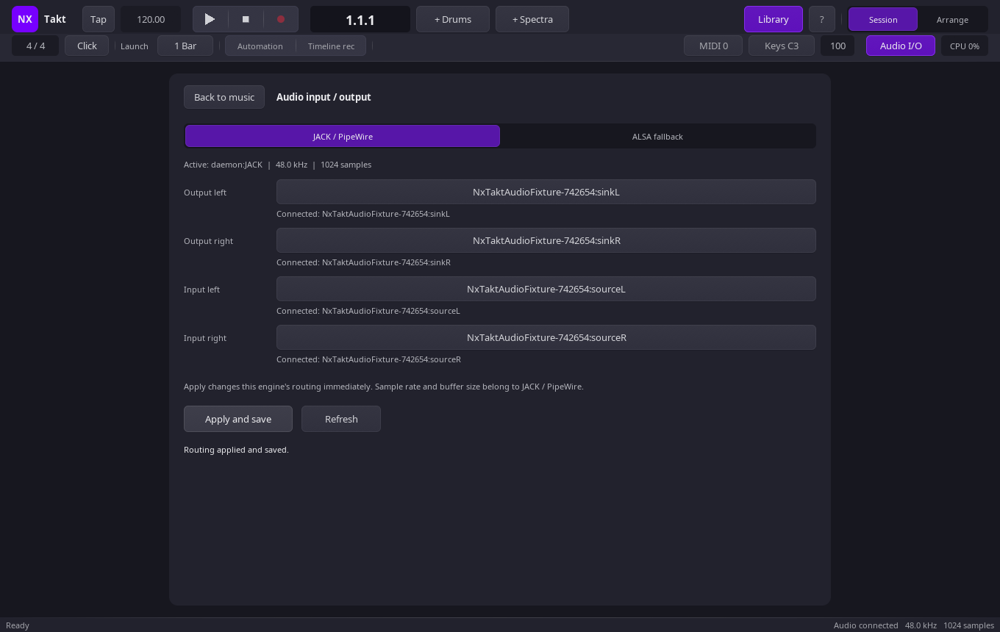

# Audio settings

NxTakt’s top-bar **Audio I/O** control opens the audio input and output panel.
The audio status line also opens it when clicked. On Linux, the panel shows the
active backend, sample rate and buffer size.

## JACK / PipeWire

On Linux, the **JACK / PipeWire** tab has four searchable route selectors:

- Output left
- Output right
- Input left
- Input right

Each selector includes **Automatic** and **Disconnected**, followed by the
available JACK ports. **Automatic** uses physical ports selected by channel
order when the JACK backend starts. An explicit port is retained as requested;
if that port is unavailable at engine start, NxTakt does not replace it with an
automatic port and leaves that route unconnected. **Disconnected** leaves the
route unconnected.

Click a route to search its available ports. **Apply and save** applies all four
JACK routes to the current engine and writes the preferences. Routing changes
are verified; a failed change is rolled back. **Refresh** rescans ports and
keeps unsaved selections.

JACK and PipeWire provide sample rate and buffer size. The panel displays those
values but does not set them.

## ALSA fallback

The **ALSA fallback** tab provides searchable output and input PCM device lists.
**Apply and save** stores the selected PCM names. They take effect when the
audio engine next starts; saving an ALSA device does not switch the active
backend. The input device is optional, so an unavailable capture device leaves
playback running without recording or input monitoring.

By default, backend selection tries JACK first and falls back to ALSA. Use
`NXTAKT_AUDIO=jack` or `NXTAKT_AUDIO=alsa` to force the Linux backend. The
environment setting chooses the backend; the panel chooses routes or saved PCM
devices within that backend.

## Persistence

Audio preferences are saved in `audio-settings.txt` at:

1. `$XDG_CONFIG_HOME/nxtakt/audio-settings.txt` when `XDG_CONFIG_HOME` is set.
2. `$HOME/.config/nxtakt/audio-settings.txt` otherwise.
3. `nxtakt/audio-settings.txt` when neither environment variable is available.

The file stores four JACK route values plus `alsa_output` and `alsa_input`.
Route and device selections remain preferences until changed in the panel.

## Windows

The Windows panel currently reports that NxTakt uses the system default audio
device. Change that device in Windows sound settings; NxTakt has no device
chooser in this panel.

## Existing JACK routing rules

Takt now names each JACK client `NxTakt-<engine PID>` to keep routing changes
scoped to the correct engine. External patchbay rules matching the old exact
`NxTakt` client name need to be updated. Takt's own saved choices name the
external device ports and are restored when its engine starts.
