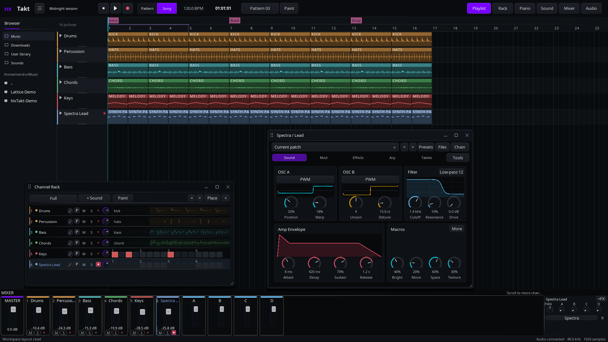

# Audio settings

NxTakt’s top-bar **Audio** control opens the audio input and output window.
The audio status line also opens it when clicked. On Linux, the panel shows the
active backend, sample rate and buffer size.

## JACK / PipeWire

Choose **Output device** or **Input device** to select a stereo pair together.
Recognized left/right channel names determine the pair; multi-channel devices
show individual pairs. **Automatic device** follows the backend's physical-port
selection; **Disconnected** leaves both channels unconnected. Use **Advanced routing** when you need individual ports or a custom patchbay connection.

**Apply and save** applies all four JACK routes to the current engine and saves
preferences. A failed route change is rolled back. **Refresh** rescans devices
and keeps unsaved selections. If a saved explicit port is unavailable, Takt
leaves it disconnected rather than silently sending your audio somewhere else.

**Restart audio engine** saves preferences, restarts the audio engine, restores the
project and device chains, and reapplies routing. Transport remains stopped.
Unsaved musical edits are retained in the GUI-owned project. Engine restart is
also how saved ALSA device choices become active.

JACK/PipeWire owns sample rate and buffer size; the window displays those values.

### Capture bus

Enable **Send master to stream bus**, then **Apply and save**, to mirror Takt's master
output to an isolated `NxTakt Discord Capture` virtual sink while retaining your
normal listening outputs. This needs PipeWire/PulseAudio control through `pactl`
and a JACK-visible sink. The bus carries Takt's output; it does not route your
microphone or change system default devices.

An external app can select the sink's monitor as an input. Discord voice-input
selection and Discord screen-share capture are separate application settings;
creating the bus does not automatically include audio in a screen-share. Test
what your friends actually hear in Discord. Disabling the bus removes Takt's
virtual sink and its connections.

## ALSA fallback

The **ALSA fallback** mode provides searchable output and input PCM device lists.
**Apply and save** stores the selected PCM names. They take effect when the
audio engine next starts; saving an ALSA device does not switch the active
backend. The input device is optional, so an unavailable capture device leaves
playback running without recording or input monitoring.

By default, backend selection tries JACK first and falls back to ALSA. Use
`NXTAKT_AUDIO=jack` or `NXTAKT_AUDIO=alsa` to force the Linux backend. The
environment setting chooses the backend; the panel chooses routes or saved PCM
devices within that backend.

## Persistence

Audio preferences are saved in `audio-settings.txt` at:

1. `$XDG_CONFIG_HOME/nxtakt/audio-settings.txt` when `XDG_CONFIG_HOME` is set.
2. `$HOME/.config/nxtakt/audio-settings.txt` otherwise.
3. `nxtakt/audio-settings.txt` when neither environment variable is available.

The file stores four JACK route values plus `alsa_output`, `alsa_input`, and `discord_capture_bus`.
Route and device selections remain preferences until changed in the panel.

## Windows

The Windows panel currently reports that NxTakt uses the system default audio
device. Change that device in Windows sound settings; NxTakt has no device
chooser in this panel.

## Existing JACK routing rules

Takt now names each JACK client `NxTakt-<engine PID>` to keep routing changes
scoped to the correct engine. External patchbay rules matching the old exact
`NxTakt` client name need to be updated. Takt's own saved choices name the
external device ports and are restored when its engine starts.
