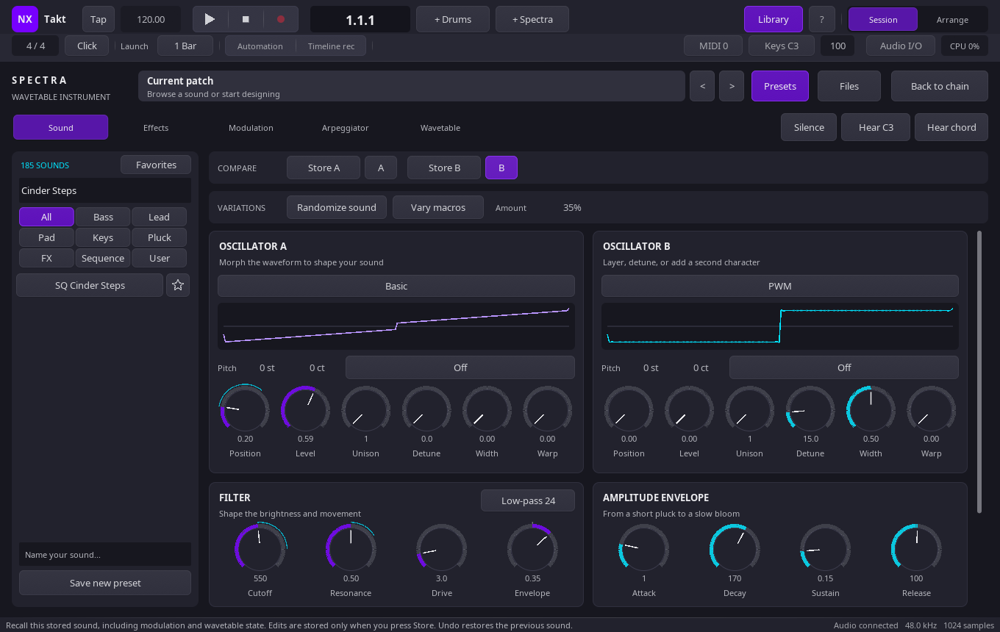
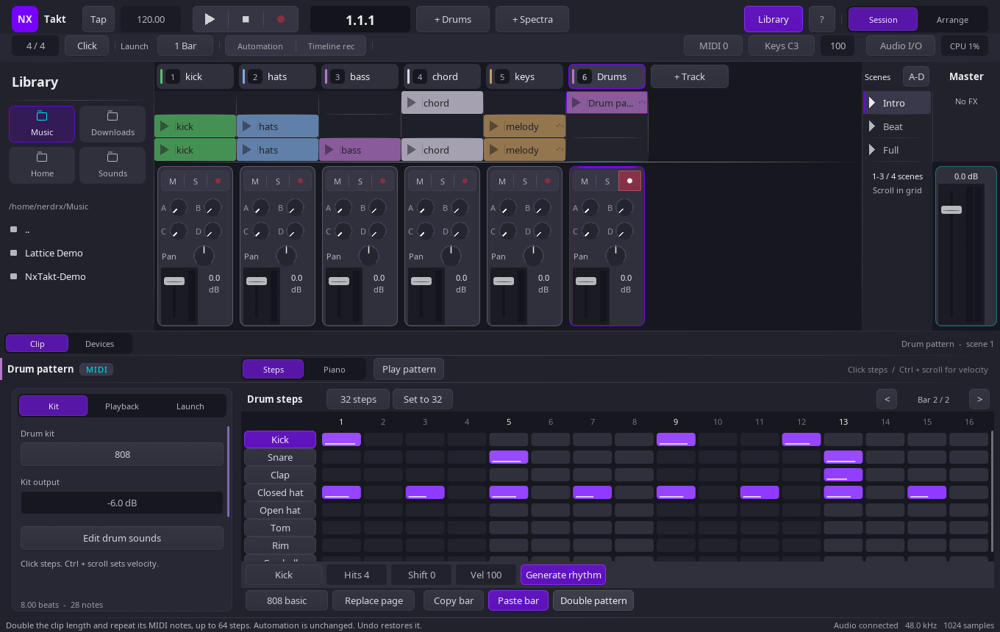
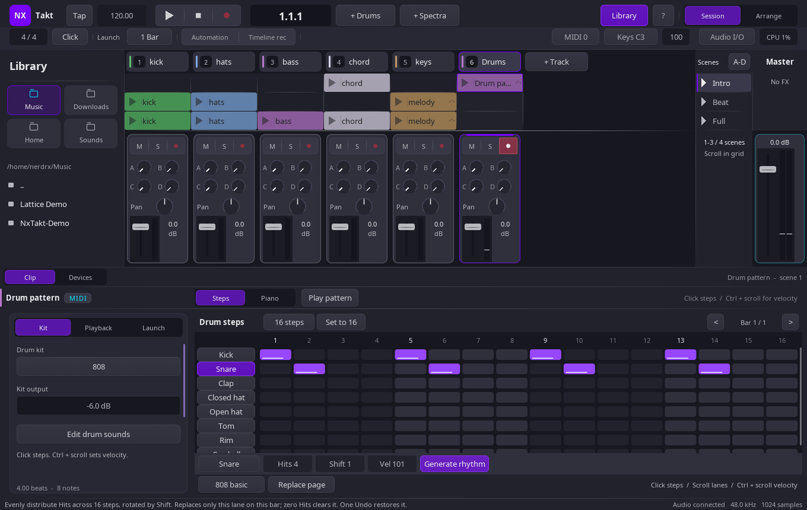
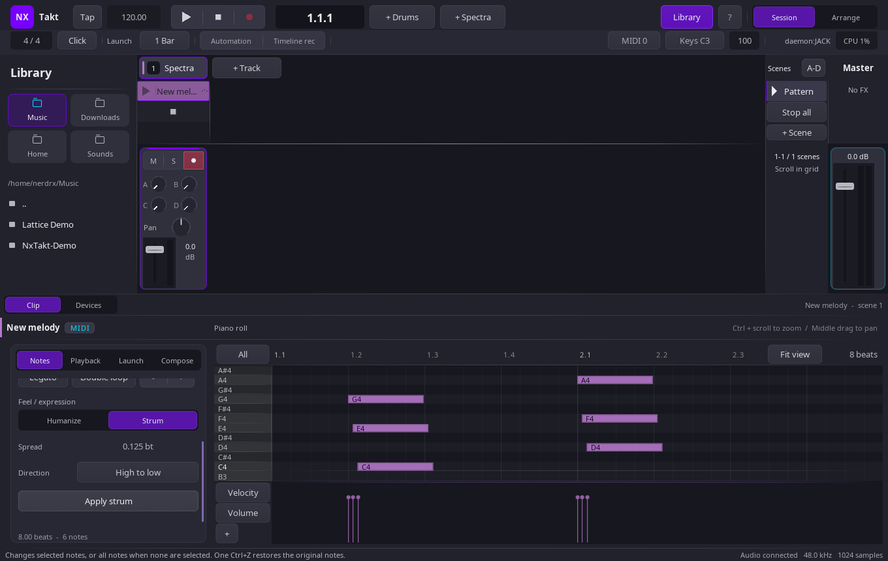
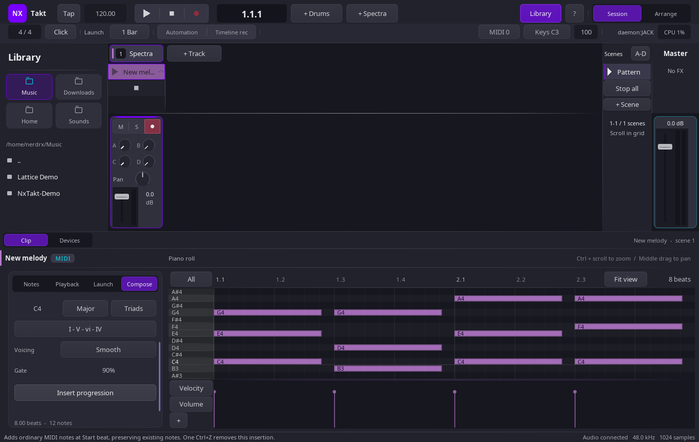

# Creative tools

NxTakt’s creative helpers keep generated material inside the same editable,
serializable project model as hand-authored clips and presets.

## Spectra A/B comparison — 0.25.0

Use **Store A** and **Store B** to capture two sounds, then click **A** or **B**
to recall them. Each snapshot includes all parameters and Spectra's additional
state, including drawn modulation, arpeggiator patterns and wavetable references.
Edits do not overwrite a slot until you press its Store button again.

Recall creates one undo step; recalling the already-active sound is a no-op.
Undo and Redo restore the full patch, including clearing modulation or custom
tables when returning to a default-state sound. Unapplied wavetable drawings
must be applied or discarded before storing or recalling a snapshot.

Slots are temporary workspace tools and reset when you open another Spectra instance.
They are not written into the project or preset bank. Save the active sound as
a preset for permanent storage; the project saves whichever sound is active.

## Drum pattern tools — 0.24.0

**Copy bar** copies the visible bar's eight drum lanes. **Paste bar** replaces
those lanes on the destination bar, preserving other bars and non-drum pitches.
Copy between drum clips or between Session and Arrangement. The clipboard
lasts for the current app session; pasted notes save normally with the project.
An empty copied bar clears the destination drum lanes.

**Double pattern** doubles the clip length and repeats its MIDI notes, up to
64 steps. It opens the repeated section so you can turn it into a fill.
Clip automation stays unchanged. Paste and Double pattern each create one
undo step; repeating an identical paste adds no undo entry.

## Drum rhythm generator — 0.23.0

The Session drum grid has a rhythm generator below its lanes. Click a lane name
to select and audition the generator lane. Set **Hits** from 0 to 16, **Shift**
from 0 to 15, and **Vel** from 1 to 127, then press **Generate rhythm**. The
generator distributes Hits across 16 evenly spaced steps using a Euclidean
pattern. With Hits set to 0, the button becomes **Clear lane**.

Generation replaces only the selected lane on the current page. Other pitches
and pages remain unchanged. Generated material is ordinary saved MIDI notes,
and one undo restores the previous lane. Repeating identical generation without
an intervening change is a no-op and creates no undo entry.

The final page can contain fewer than 16 steps. Generation skips steps beyond
that page or the clip end, so the pattern never extends the clip. **Shift**
rotates the pattern forward across its 16 steps.

## Session Notes — 0.21.0

The Session MIDI clip inspector’s **Notes** page adds **Humanize** and
**Strum** under the scrollable **Feel / expression** section. These controls
are available for MIDI clips other than drum clips. They act on selected notes;
with no selection, they act on the whole clip.

**Humanize** applies timing variation of ±0–0.25 beats and velocity variation
of ±0–64. It preserves each note’s pitch and length, and clamps its timing
inside the clip bounds. **Strum** finds notes with the same start beat and staggers
each chord by pitch, either **Low to high** or **High to low**. Spread is the
total beat distance from the first note to the last; it is shortened when the
clip end leaves less room, while note lengths stay unchanged. Select a chord’s
notes first to strum only one chord. Apply Strum before Humanize when using
both: timing variation separates the shared start times that Strum groups.

Both actions write ordinary editable MIDI notes and create one undo step. Feel
controls are temporary editor settings; they are not stored in the project.

## Session Compose — 0.20.0

The Session MIDI clip inspector’s **Compose** page adds **Progression**. One
insertion generates up to four chords, stopping at the clip boundary. Choose
major or natural minor, one of four fixed sequences (including **I - V - vi -
IV**), triads or sevenths, and root-position or smooth voicing. Set chord-beat
spacing, gate percentage, start beat and root.

Progression does not auto-extend or repeat. It inserts ordinary MIDI notes that
remain editable, and one undo removes the insertion.

**Scale run** directions are **Up** (default), **Down** from the root, and **Up
/ down**, which bounces within one octave above the root. Scale-run notes also
stay within the clip boundary and remain ordinary editable MIDI notes.

## Spectra sound variations

Spectra’s Sound page includes a variations bar with these controls:

- **Randomize sound** varies oscillator character, filter, envelopes and effects
  while keeping the selected factory or custom tables.
- **Vary macros** changes the mapped macros while retaining the rest of the
  current patch.
- **Amount** controls variation from 0 to 100, starting at 35.

Variation is bounded to the selected table. It preserves the patch’s pitch,
master settings, modulation routes, arpeggiator settings and other existing
state. Only mapped macros are varied. Each action is represented by one normal
undo step, so trying a variation does not make the edit history noisy.

## Preset favorites

Star buttons in the Spectra preset sidebar persist favorites in the XDG
configuration location `nxtakt/spectra-favorites.txt`. Factory and user preset
keys use stable `factory:` and `user:` prefixes.

The **Favorites** filter works together with search and category filters. The
sidebar’s previous and next controls navigate the resulting intersection, so
navigation never leaves the currently visible set.

## Session Compose

The Session MIDI clip inspector has a **Compose** page for chords, progressions and scale
runs. It is available for MIDI clips other than drum clips. Choose **Chord** to set a zero-based start beat, note length, root pitch,
one of nine chord qualities, and an inversion. Choose **Scale run** to set
a root, scale, note count (1–64), step spacing and note length. Drag numerical
fields to change them. Scroll the inspector to reach lower controls when needed.
In a scrollable inspector, plain wheel scrolls; Ctrl/Shift-wheel fine-adjusts the
field under the pointer.
Tool choices stay active while editing the same clip; the generated notes,
rather than these temporary tool settings, are stored in the project.

Generated material is written as ordinary MIDI notes. Notes append to the
clip and remain editable after generation. Notes stop at the clip end; a chord
that exceeds MIDI pitch limits is rejected, and a scale run stops before going
out of range. Compose provides one-step undo for a generation action, and
the resulting notes are saved with the session. A generated clip can be moved
into Arrangement like other MIDI clips.

Compose controls currently live in the Session inspector. Arrangement does not
yet expose direct Compose controls.
