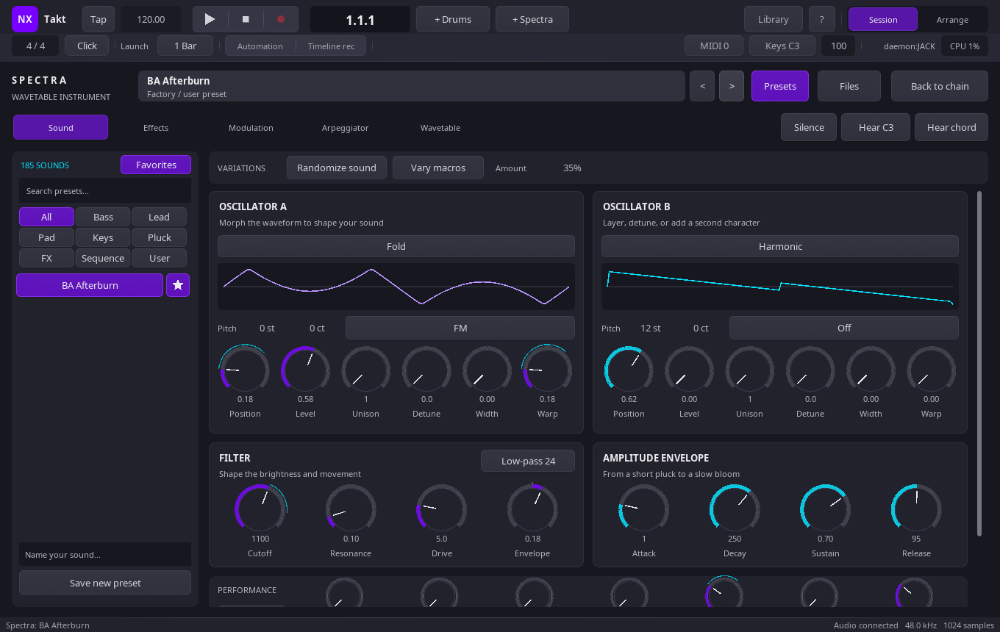
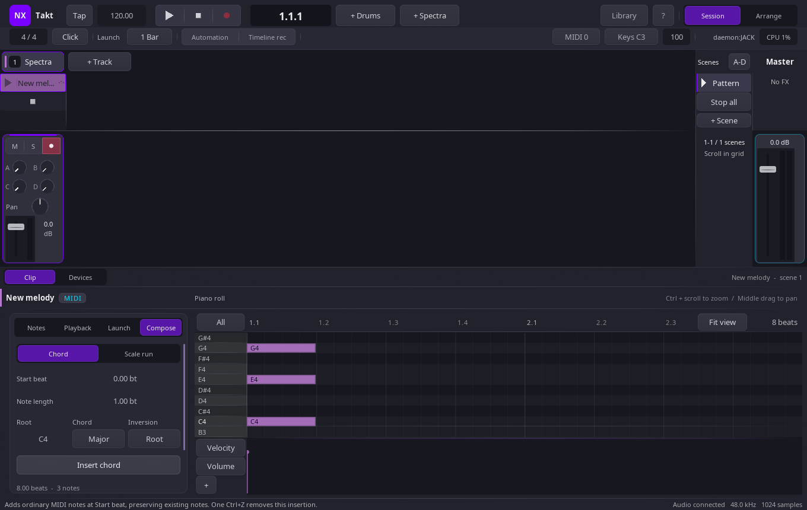

# Creative tools

NxTakt’s creative helpers keep generated material inside the same editable,
serializable project model as hand-authored clips and presets.

## Spectra sound variations

Spectra’s Sound page includes a variations bar with these controls:

- **Randomize sound** varies oscillator character, filter, envelopes and effects
  while keeping the selected factory or custom tables.
- **Vary macros** changes the mapped macros while retaining the rest of the
  current patch.
- **Amount** controls variation from 0 to 100, starting at 35.

Variation is bounded to the selected table. It preserves the patch’s pitch,
master settings, modulation routes, arpeggiator settings and other existing
state. Only mapped macros are varied. Each action is represented by one normal
undo step, so trying a variation does not make the edit history noisy.

## Preset favorites

Star buttons in the Spectra preset sidebar persist favorites in the XDG
configuration location `nxtakt/spectra-favorites.txt`. Factory and user preset
keys use stable `factory:` and `user:` prefixes.

The **Favorites** filter works together with search and category filters. The
sidebar’s previous and next controls navigate the resulting intersection, so
navigation never leaves the currently visible set.

## Session Compose

The Session MIDI clip inspector has a **Compose** page for chord and scale
runs. It is available for MIDI clips other than drum clips. Choose **Chord** to set a zero-based start beat, note length, root pitch,
one of nine chord qualities, and an inversion. Choose **Scale run** to set
a root, scale, note count (1–64), step spacing and note length. Drag numerical
fields to change them. Scroll the inspector to reach lower controls when needed.
Tool choices stay active while editing the same clip; the generated notes,
rather than these temporary tool settings, are stored in the project.

Generated material is written as ordinary MIDI notes. Notes append to the
clip and remain editable after generation. Notes stop at the clip end; a chord
that exceeds MIDI pitch limits is rejected, and a scale run stops before going
out of range. Compose provides one-step undo for a generation action, and
the resulting notes are saved with the session. A generated clip can be moved
into Arrangement like other MIDI clips.

Compose controls currently live in the Session inspector. Arrangement does not
yet expose direct Compose controls.
