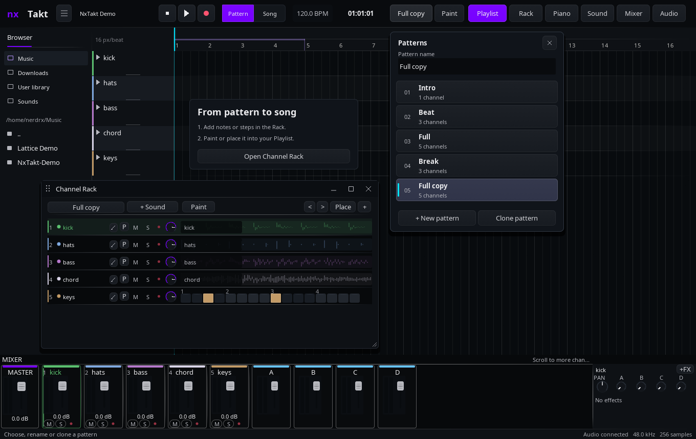
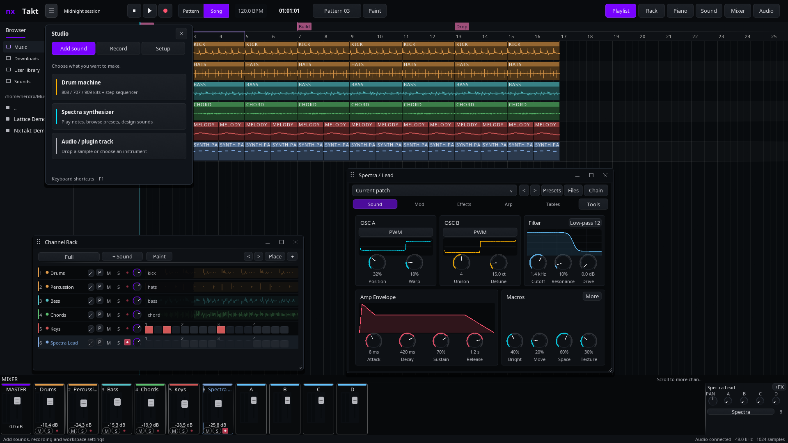

# Studio workspace

Start with the **Playlist**, a timeline for your song. **Clips** keeps the
optional scene-launching workflow available. The view does not choose what
plays: the separate **Song / Pattern** control chooses the transport source.

## From a pattern to a song

1. Click the pattern name in the toolbar or **Rack** (F6). The picker shows
   every pattern by name and channel count. Select a row, use **New pattern**,
   or **Clone pattern** to make a variation with independent clips and fresh identities.
   Click **Pattern name** to rename; Ctrl+A selects the full name. Up/Down select
   patterns when the name field is inactive; Enter closes the picker without starting playback.
2. Toggle MIDI steps in a track row. Audio clips display a label and keep their
   waveform editing in the sample editor. Drum tracks use their kick pitch for
   this quick row; open Piano for the full drum sequencer and its other lanes.
3. The small **P** action opens pattern notes. Double-click a channel name
   to open its Sound editor.
4. Choose **Pattern**, then press Space to audition the selected pattern.
5. Enable **Paint** in the toolbar or Rack, then drag across the Playlist to
   repeat the selected pattern. A translucent snapped preview shows its extent
   before you click. Empty patterns explain where to add notes. One Undo removes the entire stroke. Painting
   switches to Song mode without starting playback; Escape returns to normal editing.
   **Place** copies the selected pattern's playable tracks to the next free bar
   of the Playlist. Edit placements separately from the original rack pattern.
6. Choose **Song**, then Space to play the timeline.

Pattern mode excludes timeline lanes that have no clip in the chosen pattern.
Song mode returns all tracks to the timeline. Changing mode stops playback.

Fresh projects start with one lane and one pattern in Pattern mode.
Use **+ Sound** to create drums, Spectra or an audio/plugin channel. An unused
lane is reused, and Spectra opens its dedicated synth editor.

## Arrange your tools

Drag a window's title to move it. Drag its bottom-right corner to resize.
The title buttons minimize, maximize and close the tool.
Double-click a title to maximize or restore. The toolbar reopens tools;
The Studio menu groups **Add sound**, **Record** and **Setup**. Setup contains
**Reset layout** and the optional Live clip grid. It stays above the floating tools while open. Windows stay inside the workspace when
resizing the application or changing display scale.

Your tool geometry, order and rack/mixer/browser visibility are saved under
`$XDG_CONFIG_HOME/nxtakt/workspace-layout.txt` (or `~/.config/nxtakt/`). This is
separate from musical project data. A malformed layout falls back to defaults.

Spectra stays attached to its instrument while you select other mixer channels.
You can keep the piano/sample editor and Spectra open together. Opening a track's
Piano or Sound tool restores it from its folded state and brings it to the front.

The front window owns clicks and scrolling. Background tracks, clips and
controls do not receive gestures through another tool. Keyboard editing follows
the focused tool; text fields and popovers keep their existing keyboard capture.

**F5** Playlist · **F6** Rack · **F7** Piano · **F9** Mixer.
The mixer remains docked with the master on the left. Sends, pan and effects
follow the selected channel in the inspector on the right.
Double-click a track heading to open its device chain.

## Audio

**Audio** opens a floating settings window. Select a paired output device
or restart the engine there without reopening your project. See
[Audio settings](AUDIO-SETTINGS.md) for routing and capture-bus details.

## Development validation

Run `tools/studio-smoke.sh`, `tools/pattern-paint-smoke.sh` and
`tools/fresh-flow-smoke.sh`, and `tools/pattern-picker-smoke.sh` after building `nxtakt`, `nxtaktd` and `gen_demo`.
It creates a disposable demo and isolated, disconnected audio preferences,
then drives the real GUI in headless Gamescope. It verifies pattern placement,
independent source edits, Undo/Redo and retained notes after engine restart
against saved project data. Rename and fader edits also verify Undo;
screenshots remain in the corresponding `build/*-smoke/` directories.
Pattern painting checks duplicates, independent strokes and source notes.
The fresh-project flow verifies empty-lane reuse and instrument creation Undo/Redo.
Gamescope, gamescopectl, xdotool and Python 3 are required. `DRIVE_BIN` can select
an extracted release binary for the same test.
